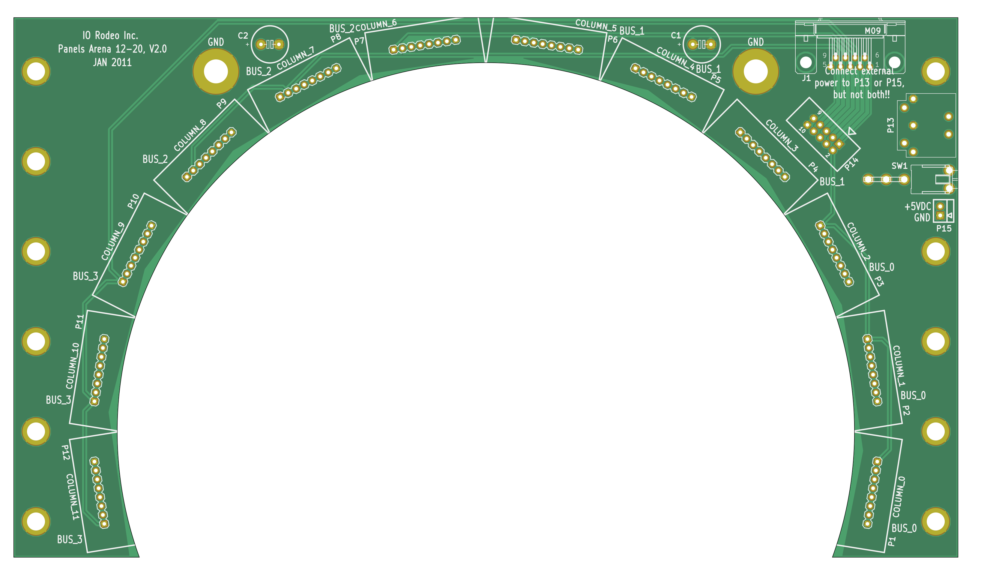
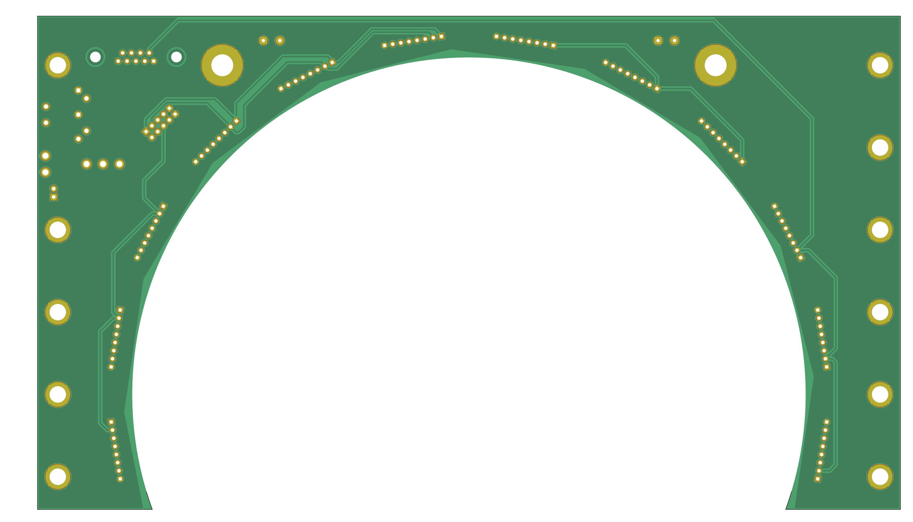

# Arena 12-20

{:.ifr .pop .clear}
{:.ifr .pop .clear}

Find the KiCad PCB for a 12/20 arena inside the `arena_12-20` project folder. Have a preview of the [schematic](assets/arena_12-20_schematic.pdf) or the [PCB layout](assets/arena_12-20_pcb.pdf).

This PCB was last ordered around 2010 from <https://protoexpress.com> under the name *panels_arena_12-20 2.0* reference number *192373-IRW* for about $75. Most likely, the content of `arena_12-20/production_v2/arena_12-20_v2p1.zip` was used for this order.

---
{:.clear}

## Project content

```
├── arena_12_20
│   ├── gerber_v1
│   ├── gerber_v2
│   ├── pdf
│   └── svg
├── arena_12_20_top
│   └── gerber_v1
├── arena_mini
│   ├── gerber_v1
│   └── pdf
├── full
│   ├── 12-ring
│   └── 24-ring
├── mod
├── pdfs
├── planar_arena_8x
│   └── gerber_v0p1
└── planar_arena_8x_base
    ├── v0p1
    └── v0p2
```