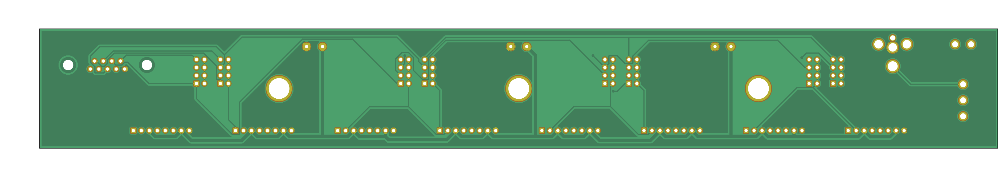

# Arena boards

An arena board organizes panels in a geometry and provides structural integrity to the whole setup. Different shapes of cylindrical arenas have been built. We use a naming scheme based on their number of panel columns available and the virtual ones forming a full circle. A 12-12 arena is a closed cylinder formed by 12 columns in total, a 12-20 describes an open virtual cylinder formed by 20 columns where 12 are actually available. For planar or linear arenas the theoretical number of virtual columns is infinite, so an 8-inf arena describes a system with 8 columns in a row.

# Arena 12-12
{:.clear}

{:.ifr .pop .clear}

The Arena 12-12 is an arena board for the Generation 2 of the Modular LED Display system. The original project file was named __JF-MR-FA0001__, the production files represent the __RevB__.

Find the EAGLE PCB for a 12-12 arena inside the `arena_12-12` project folder. Have a preview of the [schematic](assets/arena_12-12_schematic.pdf) or the [PCB layout](assets/arena_12-12_pcb.pdf). This arena was probably designed and produced around 2010.

# Arena 24-24
{:.clear}

{:.ifr .pop .clear}

The Arena 24-24 is an arena board for the Generation 2 of the Modular LED Display system. The original project file was named __JF-MR-FA0002__, the production files represent the __RevA__.

Find the EAGLE PCB for a 24-24 arena inside the `arena_24-24` project folder. Have a preview of the [schematic](assets/arena_24-24_schematic.pdf) or the [PCB layout](assets/arena_24-24_pcb.pdf). This arena was probably designed and produced around 2010.

# Arena 12-20
{:.clear}

{:.ifr .pop .clear}
{:.ifr .pop .clear}

The Arena 12-20 is an arena board for the Generation 2 of the Modular LED Display system. This is the board all panels are connected to.

Find the KiCad PCB for a 12-20 arena inside the `arena_12-20` project folder. Have a preview of the [schematic](assets/arena_12-20_schematic.pdf) or the [PCB layout](assets/arena_12-20_pcb.pdf).

This PCB was last ordered around 2011 from <https://protoexpress.com> under the name *panels_arena_12-20 2.0* reference number *192373-IRW* for about $75. Most likely, the content of `arena_12-20/production_v2/arena_12-20_v2p1.zip` was used for this order.

# Arena 12-20 TOP
{:.clear}

{:.ifr .pop .clear}
{:.ifr .pop .clear}

The Arena 12-20 TOP board for the Generation 2 of the Modular LED DIsplay system is only used for mechanical stability. Except for the grounds, there are no other electrical connections between components.

Find the KiCad PCB for a 12-20 arena inside the `arena_12-20_top` project folder. Have a preview of the [schematic](assets/arena_12-20_top_schematic.pdf).

This PCB was last ordered around 2011 from <https://protoexpress.com> under the name *panels_arena_12-20_top 2.0* reference number *192373-IRW* for about $75. Most likely, the content of `arena_12-20_top/production_v1/arena_12-20_top_v1p0.zip` was used for this order.

# Arena 1-1
{:.clear}

{:.ifr .pop .clear}
{:.ifr .pop .clear}

The Arena 1-1 is a single panel arena board for the Generation 2 of the Modular LED Display system. It's primary use is development and debugging.

Find the KiCad PCB for a 1-1 arena inside the `arena_1-1` project folder. Have a preview of the [schematic](assets/arena_1-2_schematic.pdf).

This PCB was last ordered around 2011 from <https://protoexpress.com> under the name *panels_arena_mini 1.0 1.0* reference number *192719-INTJ* for about $2. Most likely, the content of `arena_1-1/production_v1/arena_1-1_v1p0.zip` was used for this order.

# Arena 8-inf
{:.clear}

{:.ifr .pop .clear}
{:.ifr .pop .clear}

The Arena 8-inf is a planar arena board with 8 panel connectors for the Generation 2 of the Modular LED Display system. It is sometimes referred to as a hallway arena.

Find the KiCad PCB for a 8-inf arena inside the `arena_8-inf` project folder. Have a preview of the [schematic](assets/arena_8-inf_schematic.pdf). In addition the project folder contains a folder named `enclosure`. These files were apparently used to produce some kind of mounting base or enclosure for the 8-inf arena. Based on the vector file format the parts were probably laser cut. There is also a python file to generate a OpenSCAD file utilizeing the

